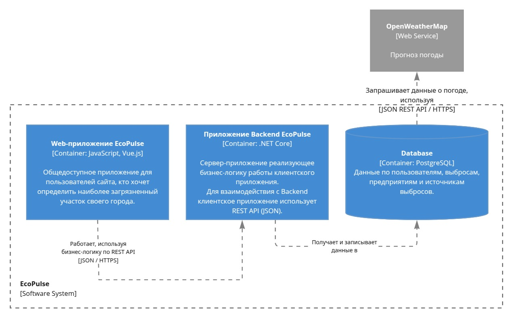

# EcoPulse

**EcoPulse** — веб-приложение моделирования распространения промышленных выбросов.

## Описание сервисов

| Сервис               | Технологии                      | Описание                                                                                                                                                                          |
|----------------------|---------------------------------|-----------------------------------------------------------------------------------------------------------------------------------------------------------------------------------|
| **EcoPulseBackend**  | .NET 9.0, ASP.NET Core, EF Core | Основной backend-сервис. Предоставляет REST API, выполняет геопространственные запросы, агрегацию данных и бизнес-логику.                                                         |
| **EcoPulseFrontend** | Vue.js 3, OpenLayers            | Клиентское SPA-приложение. Обеспечивает интерактивную визуализацию данных на карте.                                                                                               |
| **База данных**      | PostgreSQL 18 с PostGIS                    | Хранилище экологических показателей, метаданных и геопространственных объектов.                                                                                                   |

## Архитектура



## Быстрый запуск

1. Склонируйте репозиторий
```
   git clone https://github.com/xJaSzyy/EcoPulse.git
   cd EcoPulse
```

2. Создайте файл окружения .env

```
DB_USER=
DB_PASSWORD=
DB_NAME=
```

3. Запустите проект

```
docker compose up -d --build
```

### Доступ к приложению
* Frontend: http://localhost:3000
* Backend Swagger: http://localhost:5000/swagger/index.html